# Breast Cancer Predictor

A runnable, educational machine-learning project . It predicts whether a tumour is **malignant** or
**benign** from five diagnostic measurements using the Wisconsin Diagnostic
Breast Cancer data bundled with scikit-learn.

> **Important:** This is a learning/demo tool, not a medical device. It must
> not be used to diagnose, treat, or make decisions about an individual.

## Workflow

```mermaid
flowchart LR
  A[Diagnostic data] --> B[Validate & inspect]
  B --> C[Select five input features]
  C --> D[Stratified train / test split]
  D --> E[StandardScaler]
  E --> F[Compare models]
  F --> G[GridSearchCV tunes SVM]
  G --> H[Evaluate: accuracy, ROC-AUC, confusion matrix]
  H --> I[Save trained pipeline]
  I --> J[Flask web form / API]
  J --> K[Prediction with probability]
```



An illustrated version is included in `workflow-chart.svg`.

## Run it

1. Install Python 3.10+.
2. In this folder, run `pip install -r requirements.txt`.
3. Train the model: `python train_model.py`.
4. Launch the app: `python app.py`.
5. Open `http://127.0.0.1:5000`.

## Project layout

- `train_model.py` — repeatable data preparation, comparison, tuning and model export.
- `app.py` — Flask UI and JSON endpoint (`POST /api/predict`).
- `templates/index.html` — input form and result display.
- `model/` — generated model and metrics, after training.

## API example

```json
POST /api/predict
{
  "features": [14.1, 20.3, 0.10, 0.11, 0.09]
}
```

The order is: mean radius, mean texture, mean smoothness, mean compactness,
and mean concavity.
